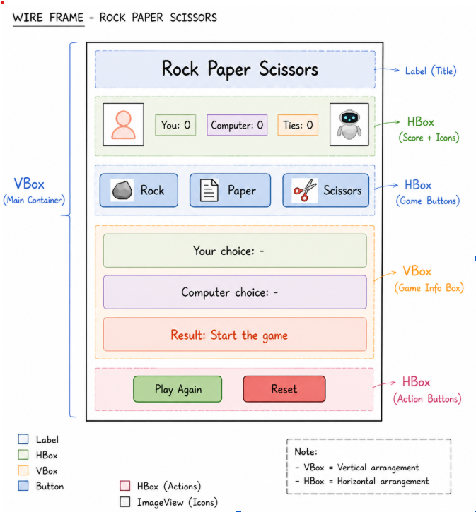

# Final Project GUI
This project is a Rock Paper Scissors game built using JavaFX.

## Final Project Description
My project allows the user to play Rock Paper Scissors against the computer. The user selects an option using buttons, and the computer generates a random choice. The program then compares both choices and displays whether the user wins, loses, or ties. It also keeps track of the score for both the players and the computer, and includes options to reset or play again.

## Features

- Rock, Paper, Scissors buttons
- Random computer choice
- Result display (Win, Lose, Tie)
- Score tracking
- Reset button

## GUI Wireframe
My Rock Paper Scissors game is here! Here is the wireframe of my GUI design :)

